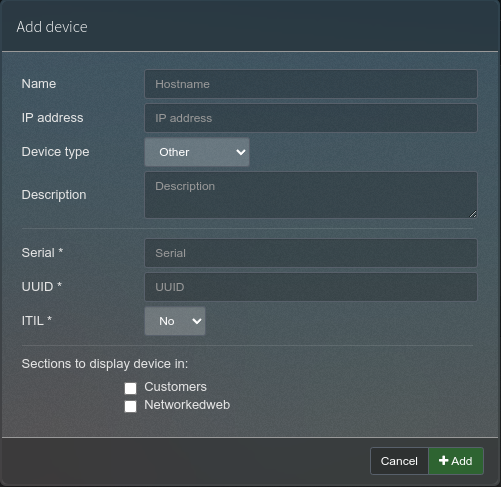

This workflow forms the first step for a new device that will be managed as part of the ITIL. The addition of this device to the IPAM system is the beginning of the management lifecycle of the device. The information contained within this system will become the single source of truth for this device where information may conflict between different systems.

## Available fields

This section visually displays the fields and their status, colour coded to their requirements. (green=required, yellow=optional, red=editable however for automation use, don't edit)

## Workflow

A new device is added using the PHP IPAM interface.

1. After login, within the interface, _navigate to `tools -> devices`_

1. Click add device, _`green button`_

1. Complete the following fields as a minimum:

    - Name

    - Device Type

    - Vendor

    - Model

    - UUID or Serial or both UUID and Serial. **Must** be one of the two fields as a minimum

    - ITIL. Check `yes` if the desire is to have this as a managed device. 

    The other fields are not mandatory and serve no function of significance.

1. Click `+Add` to save the device

## Maintenance

The following maintenance is required:

1. Information is the same between GLPI and PHPIPAM

    If GLPI is different, the data in GLPI is to be updated with the data from PHPIPAM.

1. review of the physical existence of the device

    A check to confirm the device is still in use. if not in use than it's status updated. Runbooks Disposal of a device(no_runbook_yet.md) or Device no longer in use(no_runbook_yet.md) need to be actioned.
