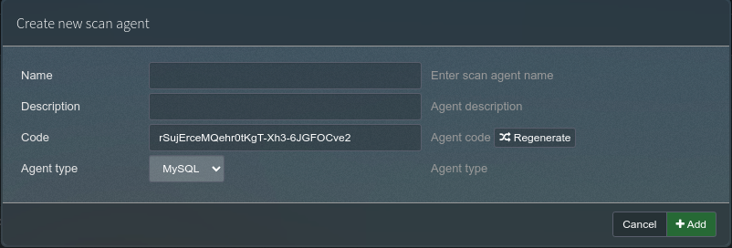

This workflow details the steps required to add a new scan agent to phpIPAM.

## Assumptions

The following assumptions are made for the use of this runbook:

- You have the required access to the phpIPAM Administration

- The Scan agent to be used is [No Fuss Computings Scan Agent](../../../ansible/collection/phpipam_scan_agent/index.md)

## Available fields

This section visually displays the fields and their status, colour coded to their requirements. (green=required, yellow=optional, red=editable however for automation use, don't edit)

## Workflow

A new device is added using the PHP IPAM interface.

1. After login, within the interface, _navigate to `Administration -> Scan agents`_

1. Click Create new scan agent

1. Complete the following fields as a minimum:

    - Name

    - Code

    The other fields are not mandatory and serve no function of significance.

1. Click `+Add` to save the device

1. Configure the [Scan Agent scanner component](../../../ansible/collection/phpipam_scan_agent/scanner.md#variables)
